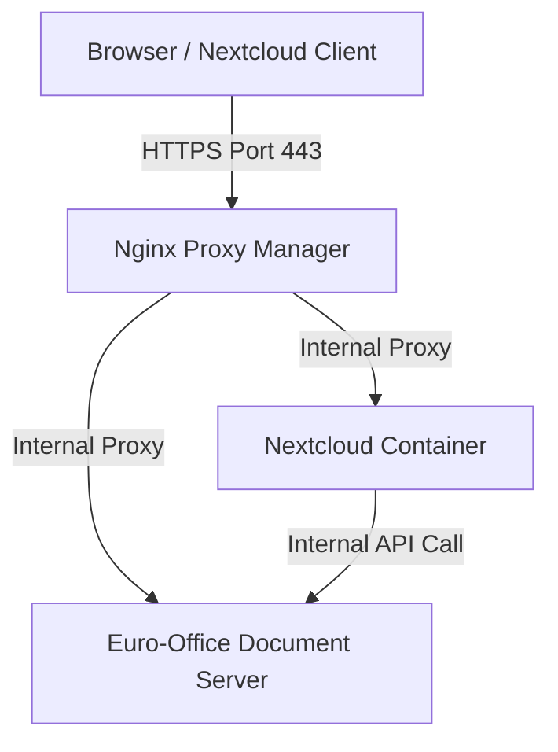

# Euro-Office Integration & Configuration Guide

Euro-Office is a key component of the **sovereign-stack** ecosystem. It provides a self-hosted, privacy-first office suite document server that allows real-time collaborative editing of text documents, spreadsheets, and presentations directly inside your browser. 

By replacing centralized alternatives like Microsoft Office 365 and Google Docs, Euro-Office forms a cornerstone of your digital autonomy.

> [!NOTE]
> Euro-Office went public in June 2026. This blueprint documents its integration within the Sovereign Stack.

---

## 1. Architecture & Network Flow

Euro-Office runs as a containerized Document Server (`eurooffice-docserver`) within the internal `pi-services` Docker network. It does not expose ports to the host by default. Instead, communication is routed securely via Nginx Proxy Manager (NPM).



* **Nextcloud Integration:** Nextcloud interacts with the Euro-Office server via the ONLYOFFICE connector app.
* **Token Security (JWT):** All communication between Nextcloud and Euro-Office is signed using a JSON Web Token (JWT) to prevent unauthorized access to your document editing server.

---

## 2. Configuration (`.env` Variables)

To secure and configure the document server, ensure the following variables are defined in your `.env` file (see [`.env.example`](file:///home/hvhoek/PycharmProjects/sovereign-stack/.env.example) for templates):

```env
# --- Euro-Office Settings ---
EUROOFFICE_JWT_SECRET="your_very_secure_jwt_secret_token"
```

In [`docker-compose.yaml`](file:///home/hvhoek/PycharmProjects/sovereign-stack/docker-compose.yaml), the document server is declared as:

```yaml
  eurooffice-docserver:
    image: ghcr.io/euro-office/documentserver:latest
    container_name: eurooffice-docserver
    restart: always
    environment:
      - EXAMPLE_ENABLED=true
      - JWT_SECRET=${EUROOFFICE_JWT_SECRET}
    networks:
      - pi-services
```

---

## 3. Nextcloud Integration Steps

Follow these steps to link Nextcloud with your Euro-Office Document Server:

### Step 3.1: Install ONLYOFFICE Connector
1. Log in to your Nextcloud instance as an administrator.
2. Navigate to **Apps** (click your profile icon in the top right → Apps).
3. Search for the **ONLYOFFICE** app.
4. Click **Download and enable**.

### Step 3.2: Configure Connector Settings
1. Navigate to **Administration settings** → **ONLYOFFICE** (under the "Office" section in the left sidebar).
2. Configure the following fields:
   * **Document Editing Service address:** `http://eurooffice-docserver/` (the internal URL within the `pi-services` network).
   * **Secret key:** Enter your `EUROOFFICE_JWT_SECRET` value from the `.env` file.
3. Click **Save**. 

> [!TIP]
> Using the internal container name `http://eurooffice-docserver/` is highly recommended because traffic remains entirely within the Docker host, boosting performance and reducing network overhead.

---

## 4. Advanced Settings (NPM Reverse Proxy)

If you need to access Euro-Office directly or access it from devices outside the local network without routing through Nextcloud:

1. Open **Nginx Proxy Manager** (http://<pi-ip>:8181).
2. Create a new **Proxy Host**:
   * **Domain Names:** `office.yourdomain.com`
   * **Scheme:** `http`
   * **Forward Name/IP:** `eurooffice-docserver`
   * **Forward Port:** `80`
3. Enable **Websockets Support** (required for collaborative real-time updates).
4. Secure it with an SSL Certificate (Let's Encrypt).
5. (Optional) In Nextcloud ONLYOFFICE settings, configure the **Document Editing Service address for internal requests from the server** as `http://eurooffice-docserver/` and the public address as `https://office.yourdomain.com/`.

---

## 5. Troubleshooting & FAQ

### Issue: "Error when trying to connect (An error occurred in the Document Service: Error while downloading the document file to be converted.)"
* **Cause:** The Euro-Office container cannot resolve the Nextcloud domain name externally.
* **Solution:** Ensure **Split-Horizon DNS** is correctly configured in AdGuard Home (see [`First-Run Guide.md`](file:///home/hvhoek/PycharmProjects/sovereign-stack/First-Run%20Guide.md#2-dns-strategy-split-horizon-configuration)). The Pi must be able to resolve `https://nextcloud.yourdomain.com` internally.
* Alternatively, in Nextcloud ONLYOFFICE settings, expand **Advanced server settings** and set the **Server address for internal requests from the Document Editing Service** to `http://nextcloud-app/`.

### Issue: "Invalid Token" or JWT Errors
* **Cause:** The `JWT_SECRET` configured in the container environment does not match the secret entered in Nextcloud administration settings.
* **Solution:** 
  1. Verify the `EUROOFFICE_JWT_SECRET` inside `.env`.
  2. Restart the stack using `docker compose up -d` to ensure the container picked up the new secret.
  3. Re-enter the exact same secret in Nextcloud and click Save.

---
*This documentation is part of the **Sovereign Stack** project.*
*Copyright © 2026 Henk van Hoek. Licensed under the GNU GPL-3.0 License.*
